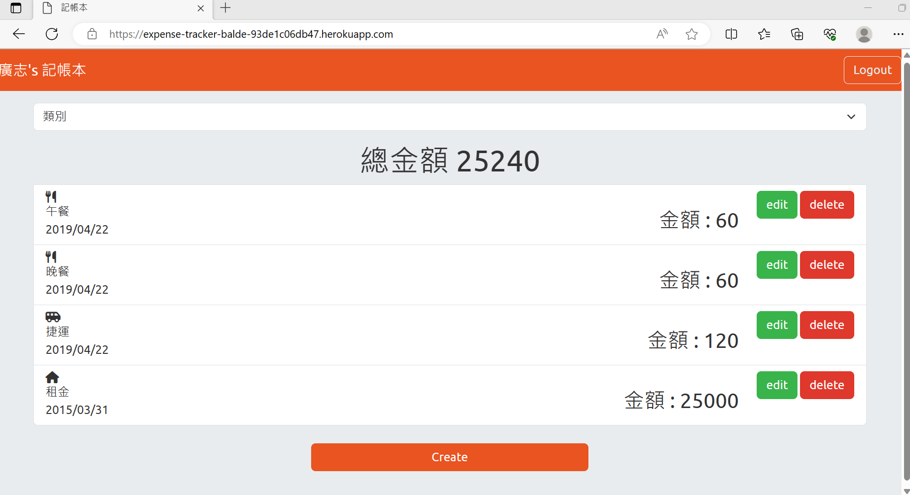

<h1>家庭記帳本<h1>
  


<h2>介紹</h2>
可新增,修改,刪除,分類搜尋 記帳項目。
<h3>功能</h3>


<h2>開始使用 (本地端)</h2>
1. 請先確認有安裝 node.js 與 npm

2. 將專案 clone 到本地
   
3. 在本地開啟之後，透過終端機進入資料夾，輸入：

   ```bash
   npm install
   ```

4. 安裝完畢後， 載入種子資料,包含兩名使用者與對應的帳本 , 使用者資料在step 6.
   ```bash
   npm run seed
   ```

啟動網頁
   ```bash
   npm run start
   ```

6. 若看見此行訊息則代表順利運行，打開瀏覽器進入到以下網址

   ```bash
   Listening on http://localhost:3000
   ```
除了Facebook登入 ,可使用下列兩組帳密登入.
   ```bash
   email: user1@example.com
   password: 12345678
   ```
   ```bash
   email: user2@example.com
   password: 12345678
   ```


7. 若欲暫停使用

   ```bash
   ctrl + c
   ```

<h2>開始使用 (Heroku)</h2>

進入下列網址:
<https://expense-tracker-balde-93de1c06db47.herokuapp.com/>
  https://expense-tracker-balde-93de1c06db47.herokuapp.com/
  <https://expense-tracker-balde-93de1c06db47.herokuapp.com/>
種子帳密與上面步驟6相同.
